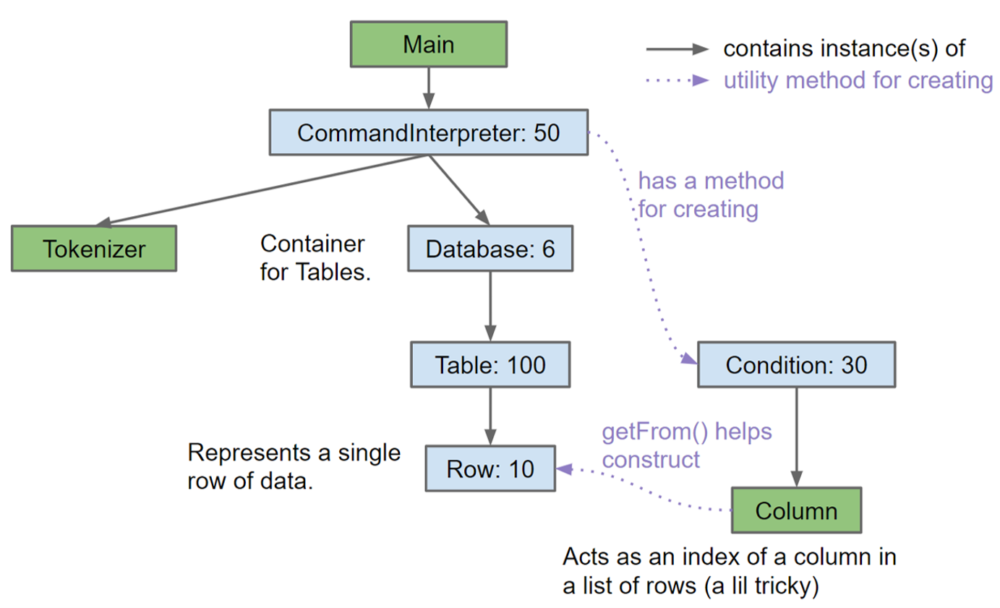
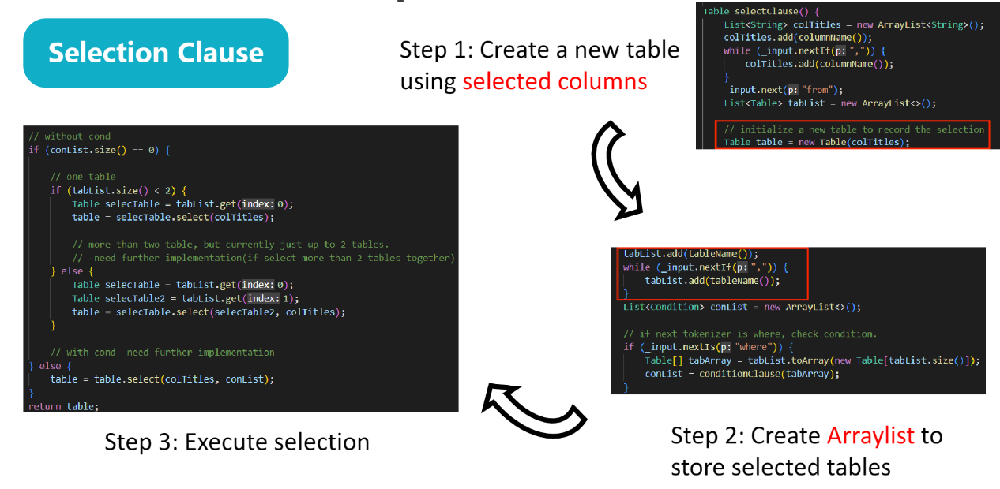

# CSC3170 Course Project Report

## Historical Progress
This is a preliminary report, which includes Project Overall Description, Team Members, Project Specification and Project Checklist.  For details, you can refer to [README](README.md).

## Program Design
Since the template we used was written by Java, we have 7 important classes to together form our major function. The basic relationship amoung classes is shown below:

For each class:
+ **Tokenizer**: Parse user commands, and interacts with database or creates conditions.
+ **CommandInterpreter**: Receive semantic information extracted from Tokenizer, and assign tasks to corresponding functions for execution.
+ **Condition**: Deal with "where condition" in select command.
+ **Column**: An index of a column in a list of rows.
+ **Row**: A single row of data.
+ **Table**: Write/read from files, and maintain db operations.
+ **Database**: Formed by tables.

Based on the hierarchical class structure, we built a [Checklist](README.md) for progress management. Group members are able to focus on the implementation of different classes in parallel. For instance, the person who implement Row class do not need to pay much attention both on the detail implementation of Column and the calling method in Table.

## Functionality Implementation
In the [CommandInterpreter](DB61B/db61b/src/main/java/t3/db61b/CommandInterpreter.java) part, there are several command implementation including Create,Load,Print,Store,Insert,Select and Quit/Exit. We mainly focus on the Select command since others use similar structure thus are easy to implement. The Selection Clause is shown below:

It shows the basic implementation of the selection part. Its logic is: whether there is a condition or not, create a table first. If there is a condition, perform a single table condition query directly on the basis of the output table. But our task also includes the selection of two tables and the selection of conditions. Our idea is to merge the selected columns and create a new table, and then perform single table condition query on the basis of this new table.

## Difficulty & Solutions
### 1. Intermediate Test:
Based the original file structure, we have to finish everything and do the final test to debug. It was quite hard to find and correct mistakes from many functions.

So, we introduced Maven management method to realise intermediate test. Once a class with several functions is implemented, the programmer could write a small piece of code to verify the correctness of that class.

In this situation, the file structure seems a little bit different. If you are confused about that, the [structure description in README](README.md) may be helpful.
### 2. Multi Tables Selection:
Even though our single table and double table selection is OK, when we try to select multiple tables, we find that when the number of selected tables is greater than or equal to 3, the selection conditions sometimes become invalid, or only the header is returned without data。

It seems that， rather than a bug the current version of the project is more so missing some implementation,which is lossing the support of condition for multi-table (3+) select. Originally after the Command Interpreter goes through the if-elses to find which exact kind of select it is dealing with it calls the corresponding function to handle that case. But now instead, it only uses the no condition variants to process a table with the Columns needed and then it Tries to apply conditions. This way its very normal that we cannot find conditions on non-selected columns. Since multi-table select is not included in the request of this project, we just give some suggestions about it:
- Try to make the "Recursive Select" able to handle condition list in the input
- Try different implementation method for multi-table such as creating a big natural joined table and then single table select with cond smthng like that ...
- Accept that the 3+ Table select won't handle conditions, for 1-2 table select goes back to the original way it was done, and for 3 tables with no condition just throw a different error to make it clear it is unimplemented rather just bug.
## Contribution
<!-- change the info below to be the real case -->

| Student ID | Student Name |GitHub Username |
| ---------- | ------------ |------------------------- |----------------------------------|
| 120090336   | 陈德坤🚩    |@[salixc](https://github.com/salixc) | |
| 120090747   | 陈清源    |@[Christoph-UGameGerm](https://github.com/Christoph-UGameGerm)| |
| 120090675   | 黎鸣     |@[Mo9L1](https://github.com/Mo9L1) | |
| 119010531 |Nasr Alae-eddine|@[H4D32](https://github.com/H4D32) | |
| 120010027  | 张家宇    |@[JJY-jy233](https://github.com/JJY-jy233) | |
| 118010408   | 张昊旻  |@[118010408](https://github.com/118010408) | Implement insert, print and load; Fill in create and store; Preliminary completion of condition, condition clause and unconditional single table selection |
